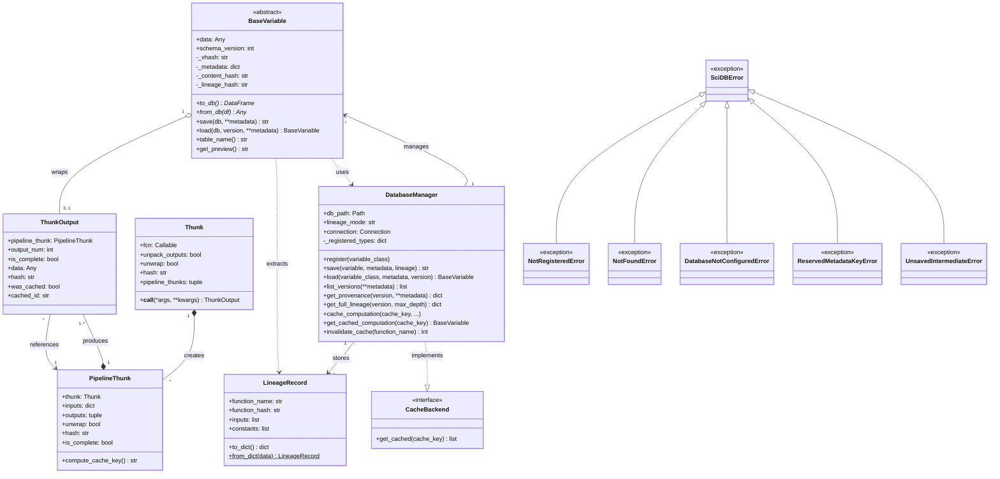

# SciDB Framework - UML Class Diagram

## Overview

SciDB is a scientific data versioning framework with two main layers:

- **Core Layer (scidb)**: Database management and variable persistence
- **Thunk Layer**: Lazy evaluation and lineage tracking

---

## Class Diagram (Mermaid)



---

## Architecture Overview

```
┌─────────────────────────────────────────────────────────────────────┐
│                        USER APPLICATION                              │
└─────────────────────────────────────────────────────────────────────┘
                                    │
                    ┌───────────────┴───────────────┐
                    ▼                               ▼
┌─────────────────────────────┐     ┌─────────────────────────────────┐
│     BaseVariable            │     │          @thunk decorator        │
│  (User-defined subclasses)  │     │    (Function wrapper)            │
│                             │     │                                  │
│  • ScalarValue              │     │  Thunk ──creates──► PipelineThunk│
│  • ArrayValue               │     │                          │       │
│  • MatrixValue              │     │                     produces     │
│  • (custom types...)        │     │                          ▼       │
└─────────────────────────────┘     │                    ThunkOutput   │
              │                     └─────────────────────────────────┘
              │ wraps                            │
              ◄──────────────────────────────────┘
              │
              │ save()/load()
              ▼
┌─────────────────────────────────────────────────────────────────────┐
│                       DatabaseManager                                │
│                                                                      │
│  ┌──────────────┐ ┌──────────────┐ ┌──────────────┐ ┌─────────────┐ │
│  │_registered_  │ │  _data       │ │  _lineage    │ │_computation_│ │
│  │   types      │ │(content-addr)│ │              │ │   cache     │ │
│  └──────────────┘ └──────────────┘ └──────────────┘ └─────────────┘ │
│                                                                      │
│                        SQLite Database                               │
└─────────────────────────────────────────────────────────────────────┘
```

---

## Key Data Flows

### 1. Save Operation

```
BaseVariable.save()
    │
    ├─► If data is ThunkOutput: extract LineageRecord
    │
    ├─► to_db() → DataFrame
    │
    └─► DatabaseManager.save()
            │
            ├─► serialize DataFrame (Parquet)
            ├─► compute content_hash
            ├─► generate vhash
            ├─► store in _data table (deduplicated)
            ├─► store metadata in variable table
            ├─► store LineageRecord in _lineage table
            └─► populate _computation_cache
```

### 2. Lineage Tracking Flow

```
@thunk
def process(data):          ─────► Thunk (wraps function)
    return transformed                  │
                                        │ __call__()
                                        ▼
process(my_var)             ─────► PipelineThunk (captures inputs)
                                        │
                                        │ execute
                                        ▼
result = ...                ─────► ThunkOutput (lazy result + lineage)
                                        │
                                        │ wrap
                                        ▼
MyVariable(data=result)     ─────► BaseVariable with lineage
                                        │
                                        │ save()
                                        ▼
                            ─────► LineageRecord stored in DB
```

---

## Relationship Legend

| Symbol  | Meaning                        |
| ------- | ------------------------------ |
| `<\|--` | Inheritance                    |
| `*--`   | Composition (lifecycle owned)  |
| `o--`   | Aggregation (shared lifecycle) |
| `-->`   | Association                    |
| `..>`   | Dependency                     |
| `..\|>` | Implements interface           |

---

## Files

- **PlantUML**: `uml_diagram.puml` - Open with PlantUML extension or [plantuml.com](https://www.plantuml.com/plantuml)
- **This file**: `uml_diagram.md` - View in any Markdown renderer with Mermaid support
